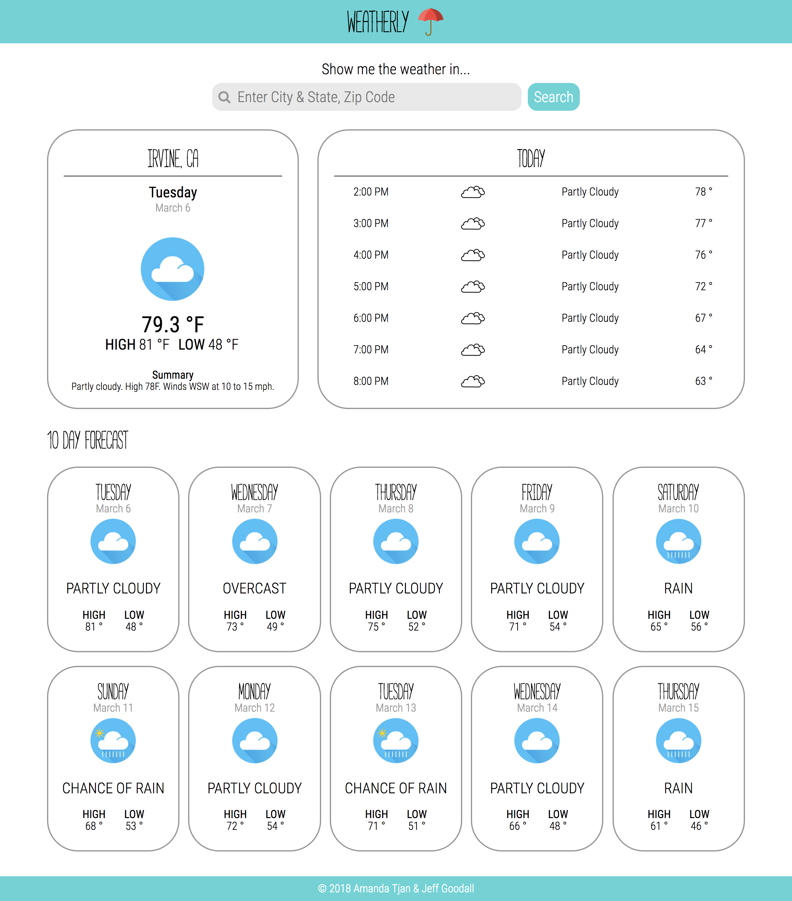
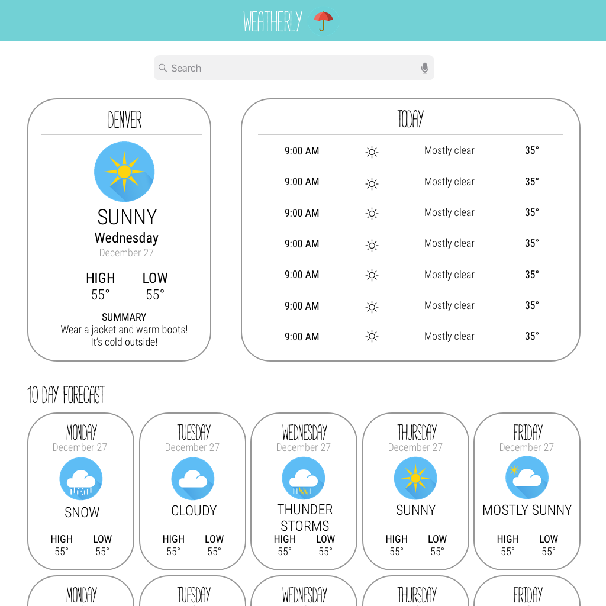
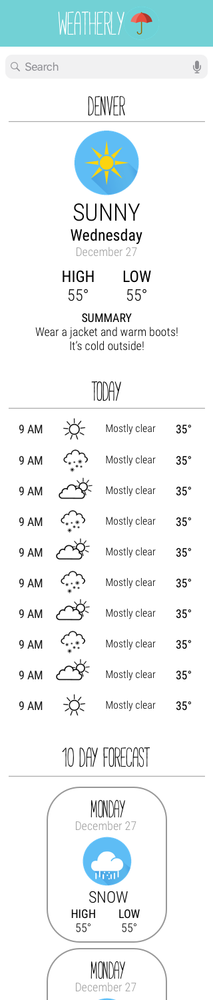

[](https://waffle.io/soytjan/weatherly?utm_source=badge)
# Weatherly - Amanda Tjan and Jeff Goodall

## Synopsis

For this paired project, we had two weeks to build out a weather app that fetched data from the [Weather Underground API](https://www.wunderground.com/weather/api/). A user can search for a location by typing in the city or the zip code in the search bar. The search bar also has an autocomplete feature. When a location is selected, a user can see the 'current weather,' '7 hour forecast,' and '10 day forecast'. This was our first real interaction with React.js, asynchronous JavaScript, and managing the state of our application. This was also our first time using Jest and Enzyme to write our test suite. 

You can find the project guidelines [here](http://frontend.turing.io/projects/weathrly.html).

## Motivation

For our Weatherly, we decided to create a whimsical UI that differentiated it from a typical Weather application. We chose a turquoise color scheme and found fun icons that fit the theme. 

## Installation

Clone down this repo.

To install the dependencies:

```
npm install
```

To fire up a development server:

```
npm start
```

Once the server is running, you can visit:

* `http://localhost:8080/webpack-dev-server/` to run your application.
* `http://localhost:8080/webpack-dev-server/test.html` to run your test suite in the browser.

To build the static files:

```js
npm run build
```

## API Reference

To use this application, you will need to get an API key from [Weather Underground](https://www.wunderground.com/weather/api/?MR=1).

Once you have the key you will need to create a file called `api.js` in the `lib` directory with the following object. 

```
const key = {weatherUnderGroundKey: 'Weather Underground key goes here'};

export default key;
```
(File path: `weatherly/lib/api.js`)

## Tests

To run tests in Node:

```js
npm test
```

## Contributors

Amanda Tjan and Jeff Goodall are the software developers for this project. 

## Project Layouts

Final Layout for Weatherly



## Project Comps

We built out a wireframe for both the desktop and mobile version using Sketch.

### Desktop Comp 


### Mobile Comp


### Icons

Thank you to 
[ourdesignz](http://www.ourdesignz.com/weather-icon/) and 
[Freepik](https://www.freepik.com/free-vector/weather-icons_1196720.htm#term=weather%20icons&page=1&position=10
) for the icons used in our project. 


